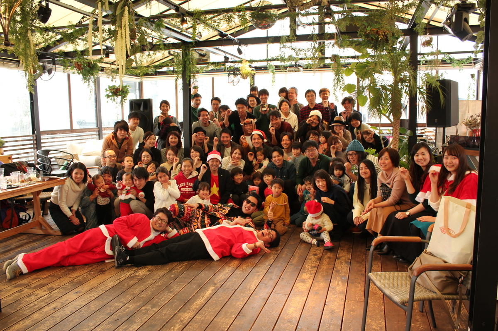

## まえがき

最初のブログ記事ということで簡単に自己紹介を。

ソフトウェアエンジニアをしている[大野木俊樹](https://www.toshikiohnogi.net/)です。2019年4月から社会人としてのキャリアをスタートしました。「アイデアを形にする」ことを得意としています。そのため、フロントエンドからインフラ、機械学習や通信まで広くて薄い知見があります。最も得意なフィールドはバックエンドアプリケーションです。

学生時代はDJのプレイリストを作る研究をしていました。結論から言うと、有用性の出し方が難しかったので研究としてはイマイチな感じで修了しました。ただ、プレイリスト生成というテーマは、現在世にある手法を応用するには悪くないトピックかなとは思います。また、個人的にDJが好きで、プレイリスト生成という研究に対して面白さは感じていました。

前置きが少々長くなりましたが、前述のようなバックグランドがあります。そして、数ヶ月前から研究の延長戦を開始していました。最近、延長戦の成果をアウトプットする機会がありましたので、本記事で成果披露の模様や結果をまとめます。

ちなみに、この記事は[株式会社i-plug](https://i-plug.co.jp/)の[Advent Calendar 2019](https://qiita.com/advent-calendar/2019/i-plug), Day 24の記事となります。Merry Christmas Eve🎉🎉🎉

## アプリケーション

DJに挑む前に、アプリケーション開発からスタートしました。今回開発したアプリケーションが担う機能は以下です。

- DJが保有する楽曲の管理
- 保有楽曲群をベースとするプレイリスト作成
- DJプレイ時に再生した楽曲の記録
- 再生済み楽曲を考慮した次曲のレコメンド

こう書くと「全部自動化してるんか？すげー！」と思う方もいるかもしれませんが、楽曲管理、プレイリスト作成、楽曲記録については手動です。マニュアル操作なんです。そこまでイケてるわけではありません。

文字だけで想像するのも難しいかと思いますので、実際に動いているところを動画にしてみました。インパクトはないですが、とりあえず動いている姿をお届けできています。

[操作の画面収録 (Twitter)](https://twitter.com/nogissh/status/1209121940373299205)

### 結果

結果から書くと、とりあえず形にはなりました。残念ながら実際のプレイ音源は録音するのを忘れてしまってお聴かせすることはできませんが、実際にプレイしたセットリストを掲載します。

|順|楽曲|アーティスト|レコメンド|
|:-:|:-|:-|:-:|
|1|Marry Christmas Original Mix|21 ROOM||
|2|Freedom Harry Romero Extended Remix|CeCe Rogers, Jack Back|○|
|3|Aguella Original Mix|Sllash & Doppe|○|
|4|Rave Me Extended Mix|PAX|○|
|5|Turbo Time Original Mix||○|
|6|Last Christmas Original Mix|Patrick Topping|○|
|7|Slip Extended Mix|Wheats|○|
|8|Bounce Yo Body (feat. DJ Dagwood) Original Mix|DJ Dagwood, Chris Larsen (CA), Gettoblaster|○|
|9|Need feat. Alex Mills Extended Mix|Alex Mills, Danny Howard, Illyus & Barrientos|○|
|10|Come On Come On Extended Mix|Darius Syrossian|○|
|11|Power Dance Mousse T.'s Disco Shizzle Extended Mix|Powerdance|○|
|12|One Day Original Mix|Saison|○|
|13|She Don't Know How Extended Mix|Frederick & Kusse|○|
|14|Something In Our Life feat. Niki Darling Original Mix|Niki Darling, Maxinne|○|
|15|Merry Christmas DJ Goy Original Mix|DJ Goy||
|16|Mother Bassline Extended Mix|Raumakustik|○|
|17|Waiting Original Mix|Friend Within|○|
|18|Ya Kidding Original Mix|FISHER (OZ)||
|19|You Little Beauty Extended|FISHER (OZ)||
|20|Trespass 2019 Mark Knight Extended Mix|Booka Shade||
|21|Everybody Dance Now Original Mix|Hoxton Whores||

このセットリストの良し悪しを測る指標がないので羅列したところで何も言うことはないのです。後日、出席していた方に聞くと良かったと言ってくれましたが。

ところどころレコメンド曲を使っていないのは、かけたい楽曲があったり、楽曲がレコメンドされなかったケースです。実装の仕様上、どうしても楽曲がヒットしないケースがあります。その場合は手動で選曲しました。

### 次曲レコメンドの仕組み

大人の事情で詳細を書くことは難しいですが、可能な限り次曲レコメンドの仕組みを説明します。まあ大したことはしていないので、精通している方はリバースエンジニアリング可能です。

今回は単純マルコフモデルを次曲レコメンドの仕組みに採用しました。単純マルコフモデルと書いていますが、ただのマルコフモデルです。マルコフモデルについて詳細は割愛しますが、最も有名？な例だけ挙げます。

上記画像は高校数学？で出題された記憶のある問題です。晴れた次の日に曇りとなる確率、晴れの次の日に晴れになる確率...と言う問題です。覚えている方は多いのではないでしょうか？

晴れの次は晴れ、晴れの次は曇り、といった事象の発生確率は、「今日晴れであれば、次の日は〜」という現在の事象に基づいて設定されます。ある事象の出現確率は現在の事象に基づいて設定されるという性質をマルコフ性と言います。単純マルコフモデルは、マルコフ性をもつ事象の発生確率を学習したモデルとなっています。

今回実装した仕組みでは、プロのDJがプレイしたトラックリスト40個ほどを学習したマルコフモデルを用いて次曲推薦させています。推薦される楽曲はもちろん自分が保有している楽曲の中から選ばれます。なお、再生済み楽曲は推薦候補から除外するなどといった細かい実装もしました。

### システム

こちらはエンジニア向け。システム俯瞰図は節の下に掲載しています。

ユーザ向けのアプリケーション実装はVue.jsとDjangoを使ったSingle Page Applicationです。特別なことはしていません。ちょっと変なことがあるとしたら、Vue.jsアプリケーションはスマートフォンでの使用を想定しており、全画面表示させたかったと言う背景から、Progressive Web Application（PWA）の枠組みを導入しています。前に記した動画はPWAで動作しているものです。iPhoneなので厳密にはPWAではないのですが。

また、Vue.jsアプリケーションのスタイルはすべてUIkitを使いました。Vue.js & UIkitという組み合わせは、私にとってここ最近の鉄板です。本業の他にもアルバイト程度にシステム開発しているのですが、そこでもVue.js & UIkitで開発しています。とにかく開発スピードが爆速です。加えてUIkitの美しい設計のおかげで、クラス指定などスタイル周りがカオス化しません。実際の見た目も余白十分かつ構造的なスタイルとなっているので、非to Cであればしばらくこの組み合わせは崩さないでしょう。同じCSSフレームワークばかり使っていると飽きはくるかもしれませんが、実用的なアプリケーションを開発することが最優先です。見た目は余裕ができたらデザイナさんにお願いします。

API ServerはDjangoとDjango REST Framework (DRF)を使って開発しています。リソースの管理に加えて次曲レコメンド機能もDjangoから提供しています。DRFは本当に便利ですね。データベースは別コンテナとして立ち上がっているMySQLを使っています。

運用はシンプルなDocker Containerです。月1000円くらいのさくらVPS上で動作しています。ユーザは私一人で強いトラフィック負荷がかかるわけではないので、これで十分です。ドメイン代が年2000円くらいなので、年間15000円くらいで動かしています。新卒エンジニアには嬉しいコストパフォーマンスです。

One Application as Multi Containerみたいな感じになっています。Nginx ProxyがHostnameによって各コンテナに向き先を振り分けています。このNginx ProxyコンテナはLet's Encryptの自動更新機能を合わせた優れものです。このDocker Imageの存在によって、SSL通信の仕組みは知っているが実装はしたことはない、そのクセにHTTPS通信を実現させているエンジニアとなってしまいました。[リンク](https://github.com/evertramos/docker-compose-letsencrypt-nginx-proxy-companion)を貼っておきます。

## 今後の展望と結び

今回は急造ではあったものの、思った以上にうまくいった感覚です。始まる前は楽曲をレコメンドしてくれるか不安でしたが、結果的に4分の3以上の楽曲をレコメンドしてくれました。また実際に現場にいた人からは少なくとも悪くなかったというフィードバックをいただけました。無事に終わって、なにより場を破壊しなかったことにホッとしました。

今後は単純マルコフモデルを派生させたn階マルコフモデルや隠れマルコフモデル（Hidden Marcov Model）などを適用して、レコメンドの精度を上げていければと思っています。また、最終的には次曲レコメンドをさらに進展させてプレイリストを組み立てられるようなモデルを構築していきたいと考えています。

さらに、一連のアプリや成果物をもっと発信していきたいとも思っています。2020年は積極的に活動していきたいとは思っています。手始めに、YouTubeなんかに手を出してみようと思っています。

最後に、自分本位のDJをさせてくれたi-plugのみなさんに感謝申し上げます。そんなi-plugはソフトウェアエンジニアを絶賛採用中です。ご興味のある方もない方も、オフィスに遊びに来てください（アンオフィシャルなので後ほど取り下げる可能性あります）。

あ、変な格好していますが、今回限定です。それから、変な人は私含めごく少数ですので、どうぞお気軽に。。

