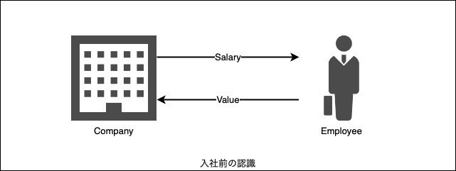
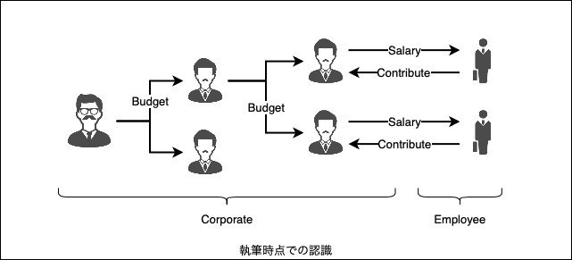
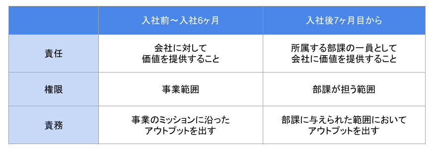

## まえがき

現職で社会人をスタートさせてから、執筆時点であと1週間ほどすると1年が経ちます。意気揚々と始まった新社会人としての1年目でしたが、残念ながらスタートダッシュに失敗してしまいました。今回はそんな1年目を振り返り、スタートダッシュ失敗に対する自分なりの見解と、2年目に向けての改善ポイントをつらつらと書いていきます。

あらかじめ書いておくと、本noteは自身の振り返りと反省が主ですので、会社がこうするべきだったなどといった話をするつもりはありませんし、邪推するのも勘弁していただきたいです。現時点では自身がどう振る舞うかが重要であると考えていますし、個人的には「会社のせい」とした時点で思考停止だと考えています。

## 主従関係の勘違い

スタートダッシュに失敗した最大の要因は「主従関係」を誤って認識してきたことでした。入社前、つまり学生時代までは、従業員というのは会社に雇われているものだと認識していました。字面だけ見ると間違ってはいなさそうです。しかし「従業員は会社に雇われている」という説明は、抽象化されている文言なのではないかと考えるようになりました。以下の図は、主である会社と、従である従業員との関係性を表しています。従業員は会社に雇われ、会社に対して価値を提供します。一方の企業は、従業員から提供される価値に見合った給料を支払うという関係性です。ごくあたりまえの、一般的な関係性であるように思います。

無知なので誤っていればご指摘いただきたいところですが、制度や法律の上では「従業員は会社に雇われている」で正しいのだと思います。従業員は会社に貢献し、対価として給与を支払う。貢献と対価という関係は、会社と従業員の基本的な関係であると考えています。

一般的な認識としてはこれで良いのだと思いますが、実際に働くとなると、より具体的な関係性を認識して労働する必要がありました。一般論としては「従業員は会社に雇われている」で良いのですが、実際には以下の図のような関係になるのかと思います。図の主従関係はあくまで例です。

ここで従業員を「管理者」と「労働者」という単語に分解します。管理者は役員を除く企業側のポジション、つまり管理職に就く人のことです。労働者は管理者からの命令により業務を遂行する人で、役職を持ちません。

上図をもとに伝えたいことは、多階層組織であるということではありません。労働者視点における現実的な主従関係は、直属の管理者、つまり上司以外にないということです。

前提として、事業を拡大させていくためには、執行部（役員）だけではリソース不足であるということです。リソース不足を補うために採用を行います。従業員数の増加と比例してコストも増加していきますので、執行部だけで人材のマネジメントを実施するというのは難しくなってきます。そこで、増加していくマネジメントコストを分散させるためにミドルレンジポジションとしての管理社を設置し、予算を割り当てるとともに、労働者を配置させます。ミドルレンジポジションのマネジメントコストが肥大した場合は、ミドルポジションの管理者自身が、より権限の小さいミドルポジションを複数設置し、各ポジションに管理職と適切な数の労働者を配置します。実際には、新ポジションの設置は執行部への提案と承認が必要になってくると思いますのでコストがかかるものだとは思いますが、そういった行為を乗り越えて、ポジションを増やしていき、業務を分散させます。

上述の前提を基に高層から中層、そして低層へと任務が言い渡されます。管理職のうち最後に任務を言い渡される管理者の元に労働者が配置されるわけですが、ここで労働者の労働目的が決まってくると考えています。

前置きがだいぶ長くなりましたが、主従関係の勘違いこそが、私が社会人としてのスタートをうまく切れなかった根本的な要因であると考えています。

まず、貢献したいと考える直接的な対象が会社でした。内定式を終えて入社式を迎えるまで、事業に良い影響を与え、会社に貢献するために何をしたら良いかということを考えていました。字面だけみると悪くなさそうな感じはしますが、入社後は自身の考えと現場の体制にギャップがあったり、先の図で表したように貢献の対象を誤って認識していたことにより上司と折り合いがつかなかったりというアンチパターンを演じてしまっていました。

そして「会社のため」や「事業のため」といった前提を基に考えていた企画を入社後に実施しようとしても、一切のFit感がありませんでした。Fit感がなかったのは自身のスキル不足による企画構成能力の低さなど複合的な要素で構成されていいますが、一般に前提の異なる企画はまったくフィットしないと考えているので、そもそもとして考えていたことは全てイケてない企画でした。

さらに、貢献の対象を誤って認識していたことにより、所属チームに多大な迷惑をかけました。上司と折り合いがつかなかったこともそうですが、所属チームの存在意義などを理解しようとするまでに半年以上かかったのではないかと考えています。理解し始めるまでが半年なので、入社して半年が経過してから、ようやくチームの存在意義やミッションを考えるようになったのです。とても戦力になるという状態ではありませんでした。

現在では入社時点比較で、いくぶん自身の立ち位置を理解できるようになったと思います。立ち位置を理解することで、関心の対象となる事実や事象に対する発言などにおいて、適切な範囲で単語や内容を判断できるようになってきました。また、所属チームの担当範囲を超えた領域について考えなくなったことで、自分が担当する範囲について考える時間が増え、チームに対する貢献の数が増加したと思います。さらに、余計なストレスを排除することもできたので、精神的なゆとりができるようになりました。

## 責任と権限および責務

導入として、単語の定義を記しておきます。単語の意味は[三省堂大辞林 by Weblio](https://www.weblio.jp/)から引用しています。

|観点|説明|
|-|-|
|責任|自身が引き受けて行わなければいけない任務|
|権限|定められた範囲のことを正当に行うことができる能力、その能力が及ぶ範囲|
|責務|自分の責任として果たさなければならない事柄|

以上のように定義した上で、3つの事項に対する自分なりの解釈を入社前後と入社後7ヶ月目からとの2軸で振り返ってみました。

3つの事項に対する解釈が異なっていることがわかります。入社前後と入社後7ヶ月目からとの解釈の差分は、前節で述べた主従関係の勘違いから発生していたものだと認識しています。発生させてしまっていた具体例としては、本来やるべき業務の範囲を超えて、別部署の人と何かを始めようとしていたりということが挙げられます。自身が所属する部署の監督責任を無視している上に、巻き込んでしまった人が所属する部署の監督責任者にも迷惑をかけてしまったアンチパターンでした。

このnoteを書くにあたって初めて3つの観点で自分の振る舞いを分解してみたのですが、切り口としてはとても良かったという印象でした。書籍「Simple Rules」で述べられている4箇条や構築までのステップに当てはまる部分も多いので、これからも活用していければと考えています。

## 意識のない期待

生意気ながら学生時代から「人に期待しない」という意識づけを徹底していました。人に対する期待を持たないようにした出来事については都合よく思い出すことができませんが、人に対する期待をなるべく持たないようにすることで、実現力を高めるためのスキルアップに目を向けられた部分はあったと思います。

一方で、入社前から働くことに対して前向きな感情を持っていました。フルタイムでの労働経験がないにも関わらず前向きな感情を抱いていたのは、今思えば働くことや組織に対して過剰に期待していたのだと思います。ここで抱いていた期待は、個人に対してというよりも、組織や概念など、実在してはいるが抽象的であるものに対してでした。

実在しているが抽象的であるものの例を挙げると、会社で言えば、上司であるAさんではなく「上司」、同僚のBさんではなく「同僚」などです。暮らしで言えば、隣に住むCさんではなく「近所の人」、安倍晋三さんではなく「内閣総理大臣」や「政府」などが挙げられます。

抽象的な実態に対する期待を捨てきれていなかったため、入社してしばらくたつと、想像していた未来と目の前で起きている現実との差分を強く感じるようになりました。結果として働く意欲が低下し、無気力な日が増加するなど、ネガティブな傾向が強くなっていきました。

幸いなことに「人に期待しない」と意識づけした過去があったので（繰り返しますが出来事は覚えていません）、意欲が低下した原因を考えることはできました。そのときたどり着いたのが、上述した「実在する抽象的な対象に対しての期待」が存在したのではないか、ということでした。

そんな中、時をほぼ同じくして、さくらインターネットのCEOである田中邦裕さんが「同意のない期待」を題材としたnoteを公開されました。

[社会人の不幸の8割は合意のない期待から](https://note.com/kunihirotanaka/n/n951df3a7f7b9)

田中さんのnoteを拝見して、自分なりにたどり着いた答えが確信に変わった気がしました。合意のない期待は「一方的な期待」と言い換えられるかと思いますが、この「一方的な期待」を意識なく持ってしまっていたことにより、身勝手な気分の高揚と意欲の低下を、自分だけの世界で発生させていました。

上の図は「期待」を個人や集団などの外面的な実態に分解し、各実態に対して内面的な分類を紐づけたものを視覚化したものです。対個人や上司、近所の人や政府などに対する失望などというのは、すべて同意のない一方的な期待と言えると思います。コミュニケーションがとれていれば、期待の範囲やレベル感がお互いに共有されているはずです。必須で求めることと、希望的に求めることの区別が明確になっていれば、結果が出たときの対応もはっきりします。すべての事象や設定についてコミュニケーションをとることは難しいかもしれませんが、少しずつクリアしていくことで、起こりうる不幸をマネジメントすることは可能なのではないかと考えています。

ちなみに、期待すること自体は悪いことではないと思います。意味のある期待はむしろ重要であると考えていますので、今後は期待を双方認識の上で設定できるようにしたいと思っていますし、そのためのコミュニケーション能力向上も図っていきたいです。

ちなみに、肩書きや瞬間に対しても期待が存在すると考えています。例えば瞬間であれば、ギャンブルが良い例かと思います。3万円の所持金を目の前で展開されているルーレットに全額ベットして負けたとしましょう。期待が一方的なケースであれば、掛け金を根こそぎもっていかれて、悲しみ、怒りなどの感情で満たされると思います。一方、ルーレットの性質や、事象の発生確率を把握した上で所持金を全額ベットして負けたときの感情は、一方的に期待して負けたケースに比べて比較的穏やかかと思います。ルーレットとコミュニケーションをとる、つまりルーレットの性質をあらかじめ把握し、双方の期待を理解することで、思い通りにいかなかった場合の感情をマネジメントすることができます。ルーレット自身は人間のように話せませんが、ルーレットが発する情報を獲得することはできるはずです。

## 終わりに

入社してから公開日までの約1年を振り返り、根本的に誤っていたことを出して、書き上げてみました。これまでアルバイトやインターンに加え、オンライン、オフラインともにイベントのホストをしてきたりしていました。それなりのスキルを持ち、それなりの経験を積んできたという自負がありましたが、それでも本記事で書いた基本的なことで躓いてしまいました。

人はそれぞれ様々なバックグラウンドを持っています。自分の行動範囲の中で失敗の「なぜ」を考えることは可能なのかもしれませんが、普遍的に適応できるいろはのようなものを見つけるというのは至難の技です。だからこそ、常に考え、そして考え続けるということが大切なのだと、特にこの2ヶ月くらいは改めて、強く感じる次第です。

公開時点では、2020年4月1日があと1週間ほどに迫っています。COVID-19の世界的感染拡大により難しいことは多々ある中、全国で4月入社の新卒社員が出現することになるわけですが、彼らには、ネット上に転がっている様々な失敗談を材料に、考え、自身を改善して、1日でも早く自分の責任を全うできる人になってほしいです。気付くまでに時間がかかったおじさんからの偉そうなアドバイスでした。
