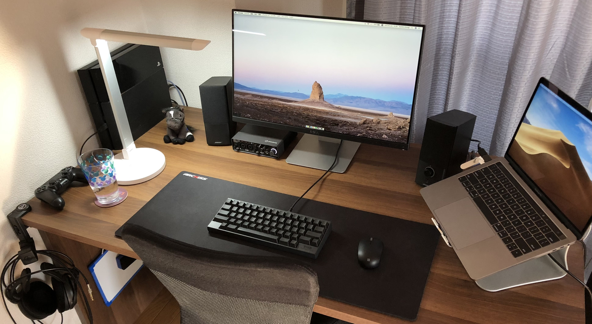
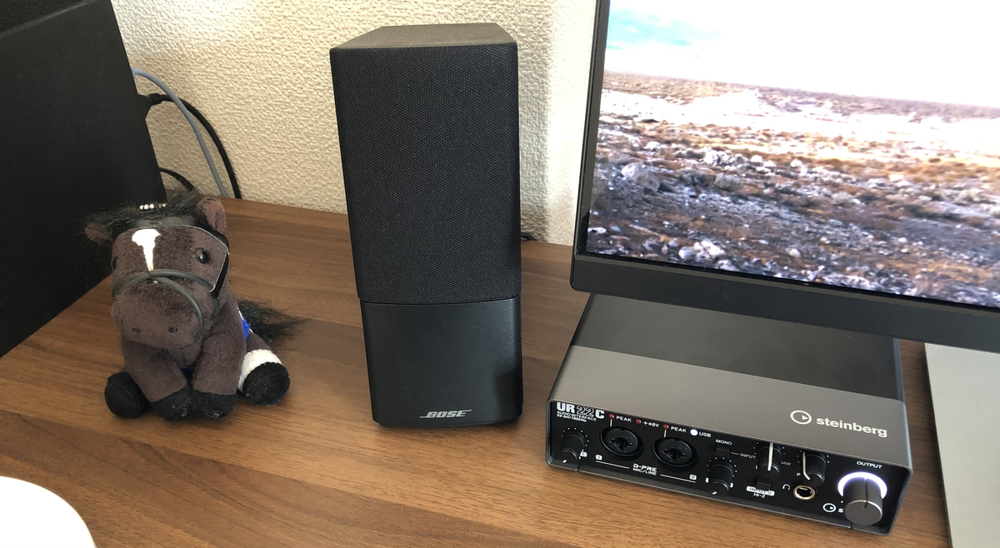

## まえがき

所属先で作業環境を晒す機会があったので、ついでにこのブログでも晒しておこうと思います。

COVID-19の影響で他者との接触を8割削減しなければいけないという特別なゴールデンウィークだからこそ、連休明けのリーモトワーク（テレワーク）環境を向上させるために活発になる人も多いのではないでしょうか。すでにAmazonやヨドバシ通販などでは、エッセンシャルではないガジェットなどが続々品切れになっています。

私の作業環境は超人と比べればハナクソみたいなものですが、現実的な予算で誰でもできる範囲だと思います。参考になれば幸いです。

## 本題

現在のデスク環境は写真のような感じです。撮影用に少々綺麗にしてはいますが、基本的に机の上は常に片付けるようにしているので、物が増えたとしても本かノートくらいです。

思いつく限りツールの名前、購入場所と参考価格くらいは書いておきます。

|カテゴリ|名前か購入場所|おおよその価格|
|-|-|-|
|デスク|LOWYA|10000円|
|チェア|LOWYA|5000円|
|チェアマット|Amazon|2000円|
|PC|Macbook Pro 13 2016|20万円|
|PCの台|Bestand|4000円|
|モニタ|DELL S2415H 23.8|25000円|
|マウス|Microsoft|2500円|
|マウスパッド|Archiss|2000円|
|キーボード|HHKB Pro2|18000円|
|卓上ライト|Tao Tronics|3000円|
|ヘッドフォン|Audio Technica ATHA900X|15000円|

こんな感じです。

PC、キーボード、モニタあたりは職業柄少々値が張ってしまっていますが、こだわりのない人は半分以下までコストを抑えられるのではなないかと思います。

他にもデスクを晒している方は大勢いらっしゃると思いますが、自分のセットアップは環境の割にはコストが抑えられているのではないでしょうか。

いまは安くても良いものが十分に流通している印象ですので、レビューなどで商品を吟味することによって信頼できるメーカ以外にも選択肢を広げることも可能な印象です。

レビューの星だけみると騙される可能性を排除しきれないので、しっかりレビューを読んで、信頼できる商品か見極める力は必要かもしれません。今時のECサイトであれば、星の操作などは対策されていると思いますが。

### 余談

つい最近仲間に加わったやつらです（馬のぬいぐるみはもう1年以上の付き合いです。ちなみに2017年オークス馬のソウルスターリングです）。

趣味程度にDJをしているので、最近はDJ体験が向上するようなガジェットに投資しました。

|カテゴリ|名前か購入場所|おおよその価格|
|-|-|-|
|オーディオインターフェース|Steinberg UR22C|18000円|
|スピーカー| Companion 2 Series III |12000円|
|モニターヘッドフォン|Audio Technica A900X|18000円|
|DJヘッドフォン|Sennheiser HD25|15000円|
|DJコントローラ|Pioneer DJ DDJ-SB2|30000円|

ど定番ガジェットで揃っています。変化球なしです。

最近買ったものはBOSEスピーカーとSteinbergのオーディオインターフェースで、それ以外は前から保有しているものです。こう見ると、自分の収入を考えるとそこそこ使ってるなという印象です。

ちなみに、Audio Technica A900Xは既に販売を終了していて、現在は口径のA900Zが発売されています。レビューを見たところ、A900Zはあまり評判が良くないらしく。。A900Xとその前のA900はとても評価が高かったので、リニューアルして評価が下がるのは厳しいですね。大切に使っていきたいと思っています。

## おわりに

極めて雑な記事ですが、現在のデスク環境をざっと書き起こしてみました。

あなたのデスク環境改善計画に役立てていただければと思います。

質問等あれば、お気軽にどうぞ。
