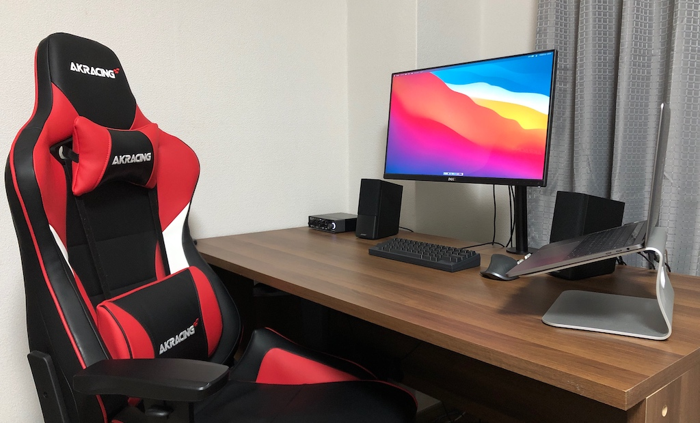
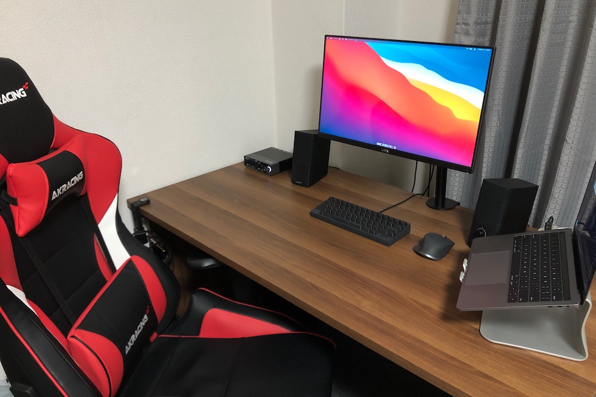
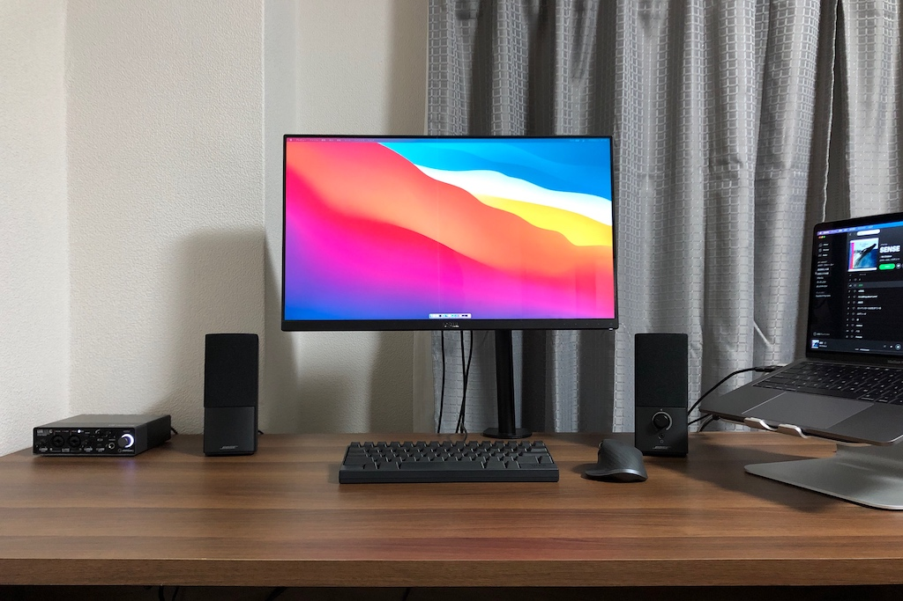
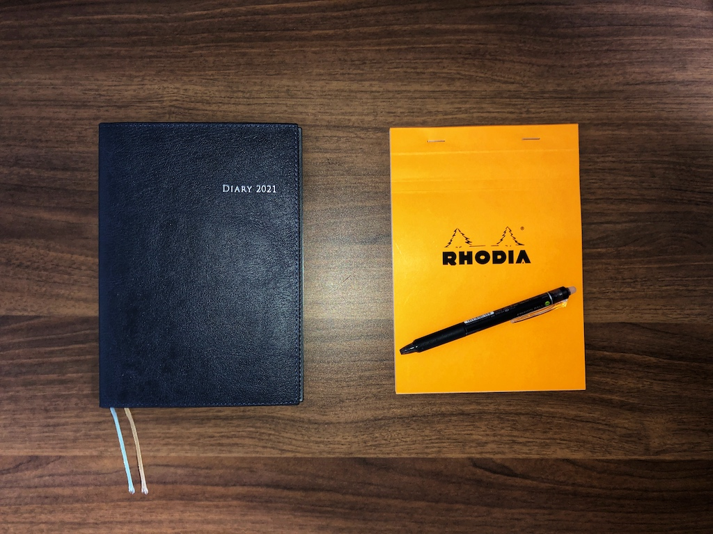

# 【デスク晒し】2021年の環境記録

2021年になり早くも1ヶ月が経過しようとしている。昨年は新型コロナウイルスによる地球規模でのパンデミックが発生し、多くの人がリモートワーク（テレワーク、在宅勤務とも）を強いられることとなった。そんな状況下において、少しでも参考になればと[私の作業環境を晒した](/articles/20200429120000/)わけであるが、いったいどれだけの人のためになったのか、いまや知る由もない。

そして今年も、見ているかもわからない誰かのため、いや、もはや自分のためだけに、デスク環境を記録として晒していこうと思う。

## 作業環境

まずは作業環境から。[前回の晒し](/articles/20200429120000/)と比べると、大きく変わった箇所がふたつほどある。

### ワーキングチェア

ひとつは、なんといってもワーキングチェアである。以前使っていた椅子は4000円ほどの安いもので、引っ越ししてきたときに購入したものであった。当時は所属企業もオフィスでの仕事が基本であったために、利用頻度は相対的に低い状態であった。しかし新型コロナウイルスによるパンデミックによりリモートワークが標準となると、安イスの強みが私の疲労感を増大させていったのであった。

そこでイスの買い替えを検討した訳であるが、当初は2万円程度の安いゲーミングチェアを検討していた。しかし、たまたま梅田ヨドバシに展示してあったAKRacingのゲーミングチェアに座ってみると、比較せずとも品質の良さを感じてしまう。さらにたまたま、ブラックフライデーの直前で、さらにさらにたまたまAKRacingのPro-Xシリーズがセールの対象となっていたため、衝動的に購入した。

購入して3ヶ月ほど経過したかと思うが、作業環境関連においては、まさに2020年ベストバイであると言える。まず確実に腰への負担が軽減された。長時間座っていてもまったく疲れないし、このイスに変えてからというもの、イスに座ったことによる腰痛は一回もない。また、ヘッドレストとリクライニングの組み合わせにより、完全にリラックスした体制を取ることができるようになり、コーディングや単純作業の肉体的、精神的負担が圧倒的に軽減された。コーディングや資料作成については、体感ではあるが、もはや生産性が向上したとはっきり言える。

通常価格は5万円ほどと決して安い買い物ではないが、しっかりとした作りと、なにより体への負担軽減およびリラックス体制による生産性の向上を検討すると、まさにこのイスはマストバイの印を押せるものだと思う。おすすめしたい。

AKRacing Pro-X V2については、[こちら](https://amzn.to/2NQfVDK)から参照できる。

### 机上の整理

ふたつ目は、デスク上の整理である。[以前](/articles/20200429120000/)までは、あらゆるものがデスク上に置いてあるという状態であった。基本的な利用においては問題ないのだが、比較的集中力を必要とするケースにおいて、PS4や馬のぬいぐるみが、意識を分散させるものとなっているのではないかという疑念を持つようになった。そこで、2020年下半期において、時間をかけてモノを削減していった。

モノを削減した結果、2021年になって、本当に必要なモノ以外について、すべて取り除くことに成功した。写真を見ていただいてお分かりのとおり、入力装置としてキーボードとマウス、出力装置としてモニタとスピーカー、音声の入出力を担うオーディオインターフェースと、6つの関心のみを机上に残した。仕事柄、基本的に6つのツールさえあれば事足りる。なんらかの作業をするにあたって、視界に必要以上の情報が入らないような状態となっている。

さらに副次効果として、机上に作業スペースを作ることに成功した。これまではなにかとコンピュータ上のメモツール等を使ってメモ書きや可視化をしていたのだが、スペースを生み出したことにより手書きでの作業等をスムースに実施することができるようになった。手書きの作業が容易となったことにより、今まで以上に思考系の作業に取り組みやすくなった。今後のアウトプットへの期待が持てる状態である。

## 新たなツールの導入

デスク晒しとは関係ないが、2021年の個人的な取り組みの一部に、以下がある。

- 読書改革
- 日々の出来事の記録

昨年は、特に下半期において、これまであまり触れてこなかった類の書籍を購入することが多かった。書籍購入の理由は主に仕事をするにあたって必要な知識のインプットであったが、新しい知識や概念が多かったうえに、ある程度のスピードを求められる状況であったため、なかなか読んだ内容が根付かなかった。

そこで、読書改革のために、読んだ対象についてのサマリを書くためのメモ帳を購入した。サマリはある程度の期間保持される想定であるために、それなりの紙である必要があった。ただ、あまりメモ帳に詳しくないという状態であったので、とりあえずRHODIAのメモ帳を購入した。罫線がもう少し薄いと嬉しいが、紙がしっかりしているので書き味は良好で、今のところ良い感じで使うことができている。

また、読書改革と同じく、特に2020年は、日々が記憶に根付かない印象を持った。そこで日々の出来事や思ったことを雑に書き留められる環境を用意しようと、手帳を購入した。「手帳は高橋」というキャッチコピーを刷り込まれていたので、ブランドは高橋とした。

このあたりについては、また気が向いたら書き起こそうかと思う。

## おわりに

2021年最初のブログ記事として、デスク晒しをトピックに、ついでに今年から導入したツールについて、少しばかり紹介した。基本的に自己満足のための記事であるため、社会においてどれだけの価値があるのかは知る由もないが、特に作業環境については、誰かの参考になれば幸いである。
