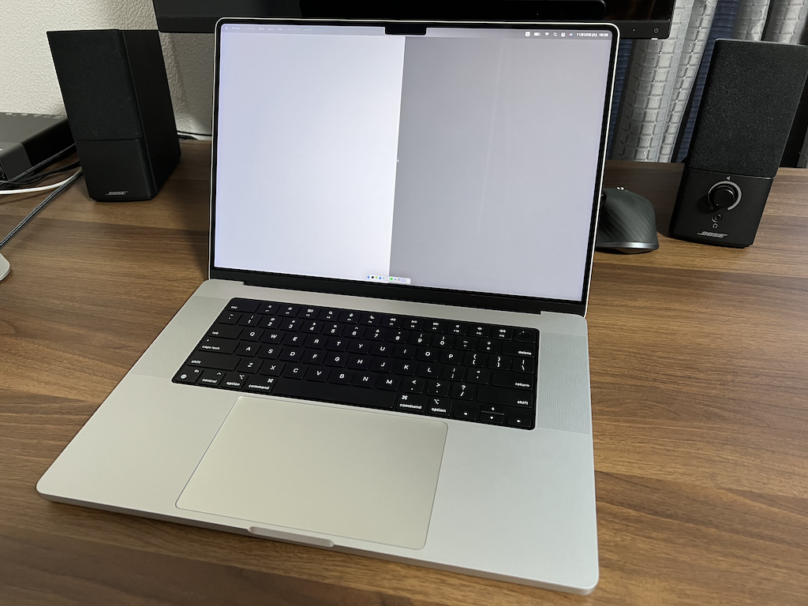
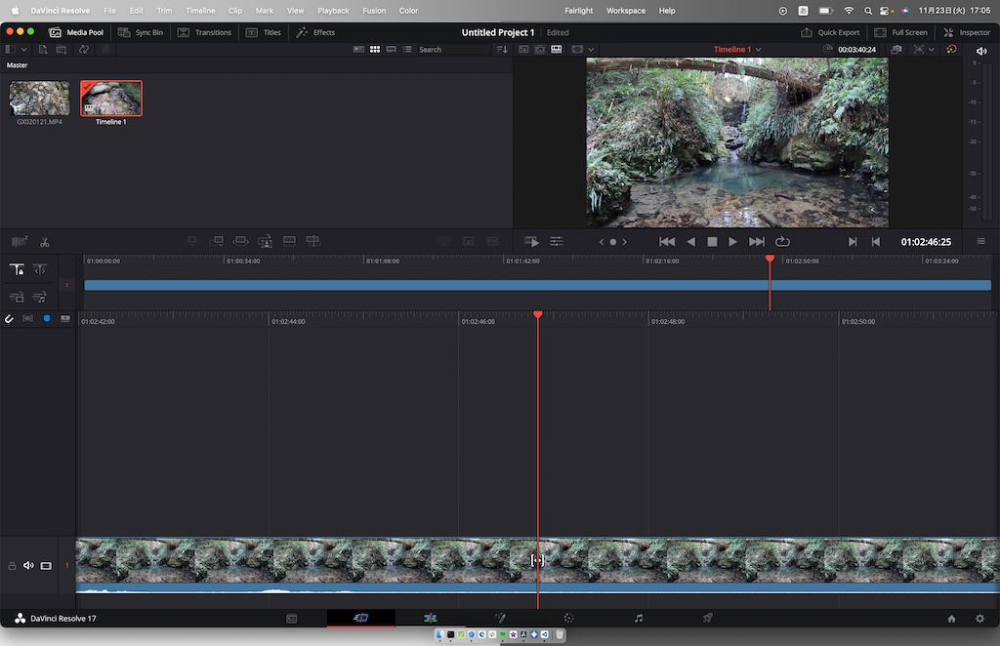
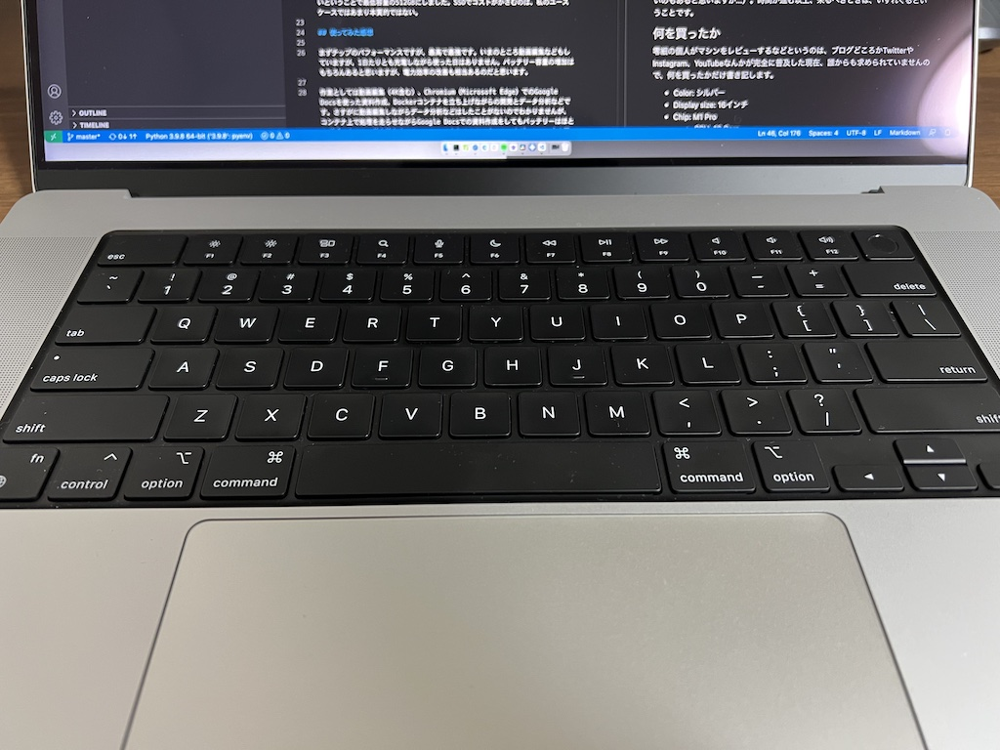

# MacBook Pro 16 2021を買いました

## はじめに

2021年10月に発表されたMacBook Pro 16インチを購入しました。写真の通りですが、色はシルバーです。以前使っていたMacBook Proは2016年に出たTouch Bar搭載の最初のモデルで、13インチのスペースグレーでした。キーボードの不具合、ディスプレイコーティングの劣化、画面焼けなど数多くの不良を搭載して世に出たマシンとも、いよいよお別れが近づいております。ソフトウェアエンジニアのスキルアップでガリガリ使ったのはもちろん、修士論文の執筆などもスペースグレーのマシンでしたので、こう書き起こすと感慨深くあります。がしかし、OSをBig Surにアップグレードしてからというもの如実にパフォーマンスが低下し、ブラウジングをまともにすることも厳しくなりつつありました（Safariのパフォーマンスが良くないのもあると思いますが...）。時間が進む以上、来るべきときは、いずれくるということです。

## 何を買ったか

零細の個人がマシンをレビューするなどというのは、ブログどころかTwitterやInstagram、YouTubeなんかが完全に普及した現在、誰からも求められていませんので、何を買ったかだけ書き記します。

- Color: シルバー
- Display size: 16インチ
- Chip: M1 Pro
  - CPU: 10 Core
  - GPU: 16 Core
- Memory: 32GB
- Storage: 512GB SSD
- KeyBoard: US

カスタマイズ可能な範囲だとこのあたりでしょうか。今回はとにかくCPUパフォーマンス最重視でしたので、フルサイズのM1 Pro以上は確定していました。そのうえで動画編集はしますがエフェクトやCG、4K素材をパラレルにどうのこおうのというヘビーなことはしないと思いますので、GPUを盛ることはせずProでとどめました。メモリは、現代の一般向けOSは機能モリモリだし、DockerでDBコンテナたてるとなったら16GBだと足りなくなるとみて32GBにアップグレードしました。SSDはいろいろな意見があるのですが、私は外付けかクラウドに逃すという基本路線なので、最低限持ち合わせられれば良いということで最低容量の512GBにしました。SSDでコストがかさむのは、私のユースケースではあまり本質的ではない。

## 使ってみた感想

まずチップのパフォーマンスですが、最高で最強です。いまのところ動画編集などもしていますが、1日たりとも充電しながら使った日はありません。バッテリー容量の増加はもちろんあると思いますが、電力効率の改善も相当あるのだと思います。

作業としては動画編集（4K含む）、Chromium（Microsoft Edge）でのGoogle Docsを使った資料作成、Dockerコンテナを立ち上げながらの開発とデータ分析などです。さすがに動画編集しながらデータ分析などはしたことがないのでわかりませんが、コンテナ上で処理を走らせながらGoogle Docsでの資料作成をしてもバッテリーはほとんど減りません。熱も持ちません。ファンはもちろん回りません。まだファンの音を聞いたことがありません。

YouTubeなどでM1 Pro/Maxの動画編集パフォーマンスのレビューをしている方は大勢いらっしゃいますが、そこでよくみるのが、4Kのトラックをドラッグしていったりきたりする、割と見るだけで目が細くなるような操作です。私もやってみましたが、本当にできます。動かす手が条件的に拒むのですが、それにM1 Proは応えます。恐ろしいです。これラップトップですよ。

次にSoftware Developmentの観点ですが、私のスキルセットではDockerのMySQLが動かなかったくらいで、他はほぼ困らなかった印象です。DockerのMySQLについては世界中にユーザがいますから、調べれば解決策はすぐ出てきます。新しい環境に乗り換えるわけですから多少の痛みは伴いますが、おそらくM1が登場した当時に比べれば圧倒的に敷居は下がっていると思います。

個人的なプロジェクトとしては、なぜかC言語の学び直しをしていまして、M1の力を感じることのないことをしております。宝の持ち腐れ。

そしてキーボード。かなり改善していて、いまのところ満足しています。キーの返りも良いし、打ち心地も悪くありません。しばらくしたら新しい外部ディスプレイが届いて、そのタイミングでマシン自体はサブディスプレイ的なポジションに移動し、キーボードはHHKBに変わると思います。しかし外出先や気分転換でこのキーボードを使うことになったとしても、まったく悪い印象はありません。本当によいアップグレードだと思います。Also, Touch Bar was gone forever.

最後にディスプレイ。素晴らしく綺麗です。16インチにしたことで圧倒的にその素晴らしさを感じます。Pro Motionで省エネを実現しながら、フレッシュレートの高い映像やページスクロールなどは非常に快適です。色も綺麗です。ストレスなくみれます。ひとつ欠点があるとすれば、ほとんどの外部ディスプレイはこのRetina XDRより性能が低いはずですので、外部出力する気にならないというのと、新たにディスプレイを買わないければいけないということになり、一層コストがかかるということです。これは個人の問題ですが、私はブラックフライデーで相応のディスカウントを発見次第、追加でディスプレイ購入することになっております。4K、60fps以上、HDRあたりは必須でしょうか。ほら、安いディスプレイでは応えられないでしょ？

普通にレビューしてるな。

## おわりに

冒頭述べたとおり、M1 Pro/Maxのレビューは別の方のアウトプットをご覧ください。そっちのほうが有益です。私から言えることは、重いことと高いこと以外に文句はないということです。サイズは個人のライフスタイルに合わせていただいて。まさにAppleの宣伝のように「サイズを選ぶ、チップを選ぶ、あとは、ぶっち切るだけ」ということです。おっしゃる通りです。
