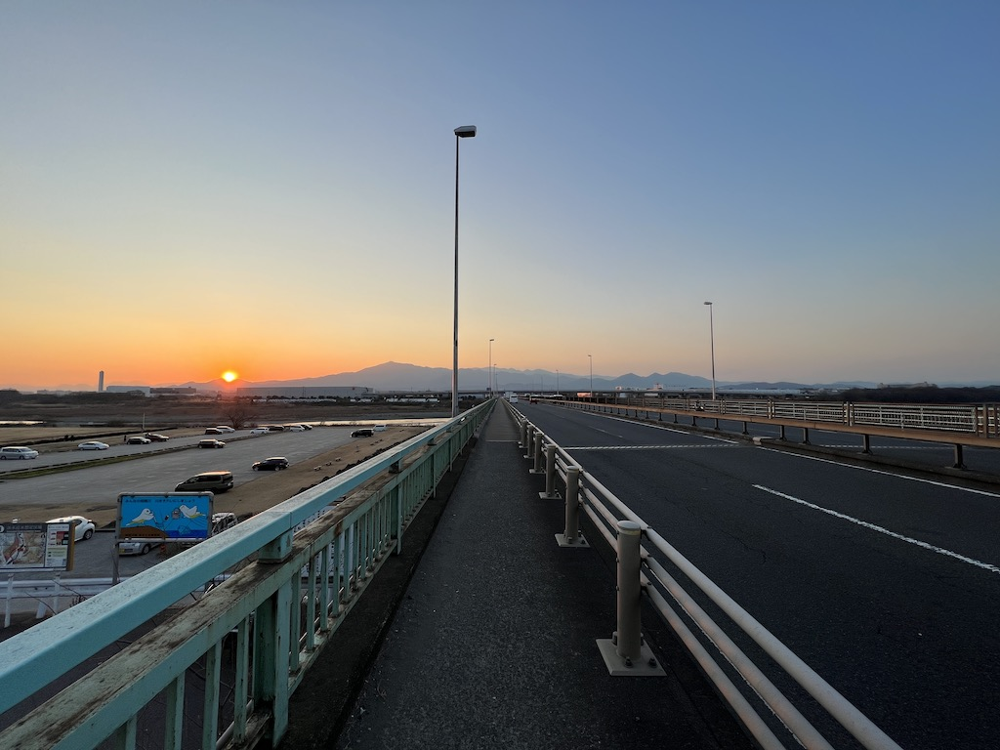

## はじめに

2023年最初の投稿です。今年はブログの更新頻度を上げていければと思っています。よろしくお願いします。

ということで新年最初のプチ旅として家系ラーメン食べ歩きの旅をしてきました。今回はその記録です。

## プラン

今回は長年のコンプレックスを解消する旅にしようと考えていました。というのも私は家系ラーメンにはうるさいと自負している元神奈川県民であるくせに、直系どころか吉村家と同じ会社の杉田家と厚木家を食べたことがありませんでした。ということで、まずは杉田家と厚木家を食べるというのをノルマとして設定しました。そこに週一以上通っていたラーメンONOMICHIを加え、3店舗を1日でまわるというのを今回のプチ旅のプランとしました。

## 杉田家

朝5時から営業している杉田家を1軒目に。9時ごろ到着したのですが、この日が新年最初の営業日ということもあってか既に20人ほどの行列が形成されていました。本当はもっと早い時間に食べたかったのですが、起きれませんでした。

列に並ぼうと思いましたが食券を先に購入せよという張り紙が。ということで店内に入りラーメン並の食券を購入。後ろに2杯が控えていたのでライスは自重しました。列に並ぶこと20分ほどして、入店し着席。

基本的に自分は麺固めのみのオーダーです。そして出てきた念願の杉田家、ちょっと感動しました。早い時間というのもあったかもしれないですが、スープは醤油が効いたシャープな感じも、旨味がガッツリ前に来る感じ。スープの底に溜まってるガラが旨味抽出の証な感じですが、骨の髄まで煮込んでいるというわけでもなく、豚骨なんだけどスッと飲める、自分好みのスープでした。麺は安定の酒井製麺、コメントの必要はないです。直系ならではのトッピングも安定の美味しさ。それをすべて吹き飛ばすくらいうまいスープが印象的でした。あとのことを考えてライスを頼まなかったのですが、本当に惜しかったです。ライスと食べたかった。通える範囲にあったらラーメンライスできるのに。

## ラーメンONOMICHI

感動的な杉田家の時間を終え、新杉田駅から保土ヶ谷駅へ移動。自分がもともと住んでいたところの最寄駅で、通っていた美容院がなくなっていたり、TSUTAYAが入っていたテナントがもはや何もない状態だったりと、いくつかの変化を確認しましたが、大きく変わっておらず、懐かしいなという感想でした。

杉田家の消化促進、デブまっしぐらの旅、加えて久しぶりに東海道（国道1号線）を歩きたいということで、駅からラーメンONOMICHIまでは徒歩で移動しました。だいたい20分くらい歩いたかと思います。久しぶりにみる景色を懐かしみながら店に向かいました。

そしてラーメンONOMICHIに到着。ここは直系スタイルではなく、六角家（そのルーツは本牧家）の系譜というかもはや姉妹店なので、六角系と呼ばれるスタイルになります。ここのラーメンは自分が保育園くらいのころから食べ続けてるので、もはや自分の中ではラーメンのすべての軸といっても過言ではありません。

## 厚木家

ラーメンONOMICHIを食べ終え、相鉄バスで二俣川駅→海老名駅へ。ららぽーと海老名で休憩したのち1時間かけて厚木家まで歩きました。その途中で相模川を渡ったのですが、その時の景色がよかったのでパシャリ。

相模川でまだ中間地点。さらに30分ほど歩いて厚木家に到着。ここも杉田家と同じく吉村家と同じ会社のド直系店です。界隈では吉村家より直系などとも表現されていますが、本家より直系というのはなんだか面白い表現です。味は杉田家より豚骨が効いているスープで、杉田家よりも吉村家寄りに思いました。吉村家より直系と言われている理由もなんとなくわかるような気がします。とても美味しかったです。

## おわりに

個人的にラーメンONOMICHIはもはや唯一無二の存在なので、杉田家と厚木家のどちらが好みだったかを検討すると、どちらかといわれれば杉田家かなと思いました。六角系が好きなところにも出ていると思いますが、豚骨のダシがしっかりありつつもしょうゆのキレやシャープさがあるほうが好みなので、杉田家かなと。ただ好みの問題で厚木家も非常に美味しかったし、近くに寄る機会があったらまた行きたいですね。杉田家は支店がいくつかあるので、そこにも行ってみたい。あとは5時から食べる朝ラーメンにも挑戦したいですね。
