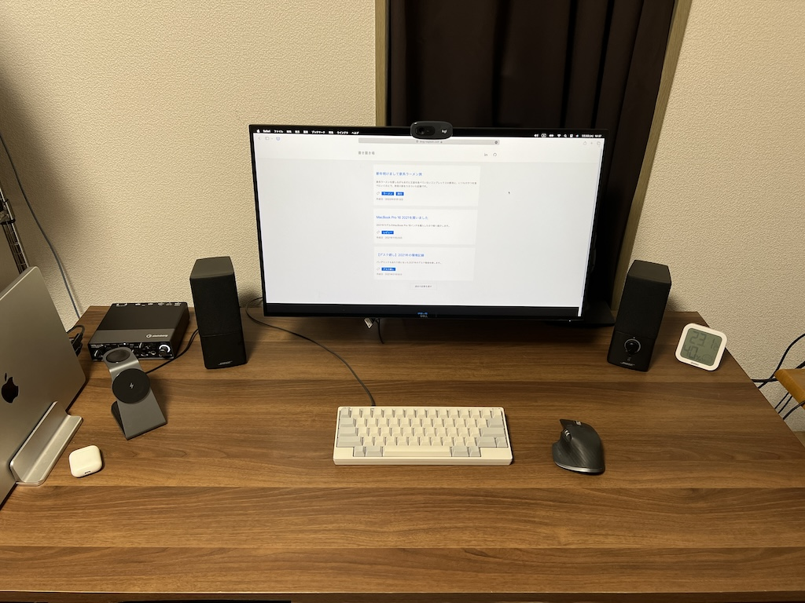
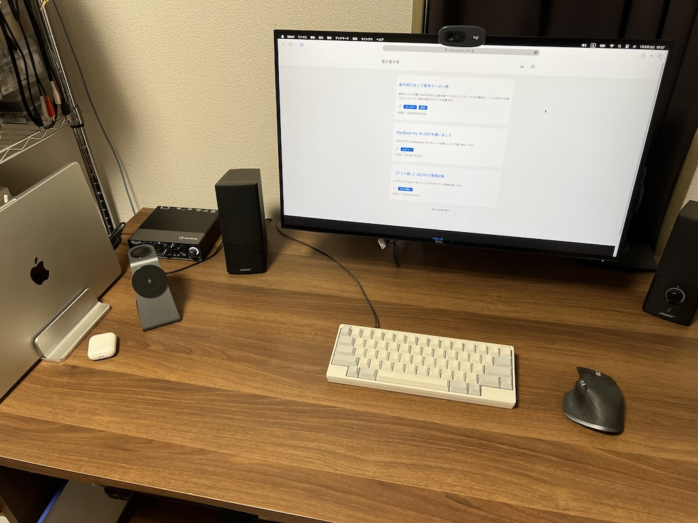
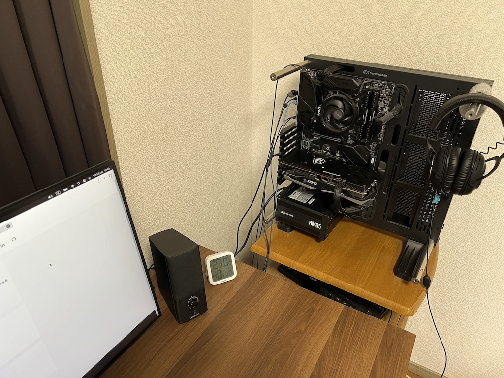

## はじめに

久しぶりのデスク晒しです。前回が2021年1月ということだったので、実に3年ぶりとなります。昨年はブログ書いていくぞと意気込んだものの、その記事だけで終わってしまいました。今年こそ自分の頭の中のアウトプット場所として活用していきたいと思っています。2024年の遺言とならないことを祈ります。

## デスク環境

[前回の晒し](/articles/20210130204943)からいくつか変更があります。

机と椅子は変わっていないのですが、部屋での置き場所（配置）を変えました。ちなみに引っ越してはいません。引っ越したいとは思っているのですが、なかなか決めには至らず。

ガジェット系はそれなりに変更があったかと思うので、整理します。

| | 変更前 | 変更後 |
| - | - | - |
| キーボード | HHKB Professional 2 Black| HHKB Hybrid White |
| PCスタンド | Bestand ラップトップスタンド | OBENRI Vertical Laptop Stand |
| モニタアーム | BESTEK PC BTSS01BK | エルゴトロン LXモニターアーム ブラック |
| 充電スタンド | - | TEPNICAL 3in1 Magsafe充電器 |

大きな変更点はこの4つでしょうか。特にキーボードは大きな変更でした。HHKB Professional 2は22歳の時に購入したので、実に7年ほど稼働してくれました。いまでも元気ではあるのですが、ワイヤレスの選択肢が欲しかったのと、無刻印白に憧れがあったので、2023年にHHKB Hybridに買い換えました。HHKBブランドには絶大な信頼があるので、店頭確認せず買ったのですが、打鍵感がとても自分好みで、無刻印白とワイヤレスというニーズを超えた満足感を得られました。家では電池がもったいないので有線に繋いでいますが、気分によっては家でワイヤレス接続して使っています。35000円は決して気軽に買えるものではないかとは思いますが、この買い物は間違いなく2023年ベストバイでした。

もうひとつ大きな変更というところでは、PCスタンドでしょうか。これまではスタンドに置いた上でサブモニターとして使えるようなものを使っていましたが、現在はクラムシェルモードで使うタイプのものに変更しています。ちょっと思想の強いことを書くと、仕事にもよるという前提はあるうえで、モニター1枚で捌けない仕事の仕方は、そもそも効率の悪いやりかたであると考えています。なのでサブモニターがあっても使わないし、場所をとるだけでした。M1チップという革命が起こされた現在、ラップトップの熱問題もほとんど起こらない状況ですので、思い切ってクラムシェル利用に切り替え、デスクのスペースを広げました。結果としてはとても快適で、とてもよい変更だったと思っています。

あとは充電スタンドを置きました。iPhone、Apple Watch、AirPodsが充電できる3 in 1タイプです。私のAirPodsは第1世代でワイヤレス充電機能がついていないのですが、右のバッテリーが死にかけているのと、Apple初売りでちょっとお得になっているので、このタイミングで買い替えてしまおうかと検討中です。

2024年1月4日追記：AirPods Pro 2nd genを購入しました。

## ゲーミングPC

もう1年以上前になるのですが、ゲーミングPCを「自作」しました。昔から自作PCに憧れがあったのですが、久しぶりにPCゲームがしたくなったので、そのタイミングで自作PCにチャレンジしました。そのブログを書こう書こうと思い、早1年以上が経過しようとしているのですが、それでもいつか自作PCの記事を書きたいなと、まだ思っています笑

## おわりに

ひさしぶりのブログ投稿、そして3年ぶりにデスク晒しをしました。引っ越ししていないのと、机が変わっていないので大筋の方向性としては変わっていないのですが、個別に見ていくとまあまあな変更があったかなと思います。今年も余裕があればアップデートしていきたいと思っているので、ブログネタに使っていきたいと思っています。
